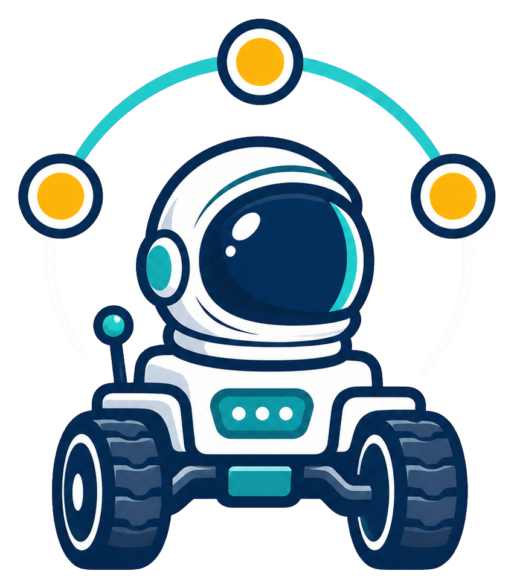
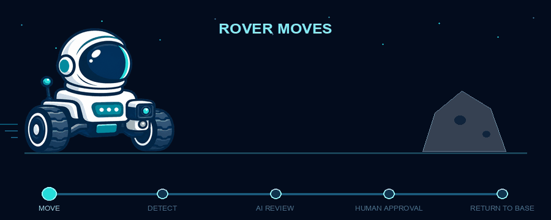

 <big><big><big><strong>DAGstronaut</strong></big></big></big>

 
 

<strong>It stops five centimetres from an obstacle—and waits for a human to decide what happens next.</strong>

**An Apache Airflow 3 DAG that drives a physical micro:bit rover: it senses with
ultrasound, reads the obstacle with a local vision model, and waits for a human
to authorize every movement. A dedicated five-inch Flight Director Console
presents the evidence and records that decision through Airflow.**

[Beyond the DAG 2026](https://www.astronomer.io/events/beyond-the-dag-data-engineering-hackathon-2026/) · [Apache Airflow](https://airflow.apache.org/) · [Airflow Plugins](https://airflow.apache.org/docs/apache-airflow/stable/administration-and-deployment/plugins.html)

 

> [!NOTE]
> DAGstronaut is an independent open-source project created for
> Astronomer's **Beyond the DAG 2026** hackathon. “Astronomer” and related marks
> belong to their respective owners; this project is not an official
> Astronomer product.

## Why space, robots, and a flight director?

Because the hackathon is run by Astronomer, space is a natural theme for the
project. It also fits the way physical automation works: a mission advances
through ordered stages, reports telemetry, respects explicit safety boundaries,
and pauses for a human decision when judgment matters. The rover makes the DAG
physical, while the flight-director metaphor makes Airflow's role easy to
understand without hiding the real tasks, evidence, decisions, or commands
beneath the theme.

## What is DAGstronaut?

DAGstronaut is a physical rover mission orchestrated end to end by Apache
Airflow 3. Instead of moving data between systems, its DAG moves a real machine
through the world—carefully, visibly, and with a human in command.

The rover advances one motor pulse at a time and checks its ultrasonic sensor
before every move. When it reaches an obstacle, it stops, captures a photograph,
and sends the image and distance telemetry to a local vision model. The model
explains what it sees and recommends a response, but it cannot move the rover.
An Airflow HITL task holds the mission until a human flight director reviews the
evidence and chooses what happens next.

Airflow is more than the scheduler behind the demo. The DAG defines the safety
sequence, XCom stores the rover's outbound path, task logs preserve the mission
record, and branch dependencies ensure that no physical action can bypass human
approval. After the chosen maneuver, the rover reverses its recorded steps and
returns to base.

A focused Airflow plugin turns a five-inch Raspberry Pi touchscreen into the
Flight Director Console. It shows the rover image, sensor readings, and AI
recommendation, then submits the human's selected branch through Airflow's HITL
REST API. It never talks to the rover directly.

> **The rover explores. AI advises. A human commands. Airflow brings it home.**

### 1. Planet Exploration Rover — a hardware-orchestrating Airflow DAG

The heart of the project is the `planet_exploration_rover` DAG, which controls a
real wheeled rover and coordinates a complete physical exploration mission.

The rover performs a motor systems check, moves forward one step at a time, and
sends an ultrasonic distance reading back to Airflow before every movement. At
the configured five-centimetre safety boundary, it stops and captures the
obstacle with a computer USB camera. Gemma Vision analyses the photograph and
sensor telemetry, then an Airflow HITL task asks a human flight director to
approve the next action. Airflow records outbound movement in XCom so the rover
can reverse the same number of steps and return to base.

**Airflow features used:**

- **`@task.llm` from `apache-airflow-providers-common-ai`** runs the multimodal
  assessment. The task sends the camera frame and sensor telemetry to a local
  Gemma 3 vision model and returns a Pydantic-validated `ObjectPrediction`
  through `NativeOutput`, so malformed model output fails the task instead of
  reaching the human. Only the compact assessment enters XCom—the JPEG and its
  base64 payload never touch the metadata database.
- **`HITLBranchOperator`** pauses the mission at the Flight Director's Console
  and routes execution to turn left, turn right, reverse, return to base, or
  abort. The model recommends; it cannot select the branch.
- **Jinja-templated HITL content** renders the object prediction, confidence,
  visual evidence, recommendation, and camera filename into the decision screen
  the human actually reads.
- **A named `outbound_steps` XCom**, rewritten after every successful forward
  movement, is the rover's durable mission memory. Return tasks read it to issue
  the matching number of backward motor pulses, so a mid-mission sensor failure
  still leaves a correct return distance recorded.
- **Branch-aware trigger rules** converge the mutually exclusive movement
  branches into one shared return-to-base task with
  `none_failed_min_one_success`, which then computes the inverse of whichever
  maneuver the human chose.
- **XComArg wiring** passes data by reference between a classic operator and a
  decorated task—`op_kwargs={"detection": explore.output}` feeding
  `predict_detected_object(capture.output)`—without a manual `xcom_pull`.
- **Task dependencies as safety interlocks.** The rover cannot explore before
  its systems check, photograph before detecting an obstacle, or move again
  before the human decision resolves. The graph is the safety model.
- **`max_active_runs=1`** prevents two missions from driving the same physical
  hardware at once.
- **`doc_md`** publishes the mission sequence, safety model, runtime
  architecture, and configuration table directly into the Airflow UI, so the
  DAG documents itself where an operator is standing.
- **Task logs and run history** preserve every sensor reading, bridge response,
  model assessment, human decision, and movement count—a replayable audit trail
  for an irreversible physical action.
- **A read-only Docker volume** exposes the captured photograph inside Airflow
  at `/opt/airflow/rover_captures`, keeping the camera on the Mac while the DAG
  task reads the evidence.

The physical build uses:

- A [BBC micro:bit board](https://www.keyestudio.com/collections/microbit-board)
  running the rover's [MicroPython firmware](microbit_firmware/README.md)
- A [Keyestudio micro:bit robot car](https://www.keyestudio.com/collections/microbit-car-415)
  repurposed as the mobile rover platform with custom firmware developed for
  this hackathon
- A [Keyestudio CS100A ultrasonic module](https://www.keyestudio.com/products/keyestudio-quick-connectors-ultrasonic-modulecs100a-chip-black-environment-friendly)
  for obstacle-distance telemetry
- A computer USB camera, read through OpenCV, that captures a forward-facing
  JPEG only once the ultrasonic sensor reaches the safety boundary
- Gemma 3 Vision on local Ollama, which keeps every frame and every inference on
  the same machine as the rover—no image leaves the host
- A USB connection to the [Mac USB bridge](mac_os_api/usb_bridge.py) that exposes
  rover movement, sensor, and camera operations to Airflow; see the
  [USB controller setup guide](mac_os_api/USB_CONTROLLER_README.md) for setup
  and usage

### 2. Flight Director Console — a physical approval surface

The second part is a dedicated approval screen mounted beside the rover and a
reference implementation for human-supervised IoT operations. An
[Apache Airflow 3](https://airflow.apache.org/docs/apache-airflow/stable/index.html)
plugin installs a React app designed for a five-inch Raspberry Pi touchscreen.
For this project it deliberately monitors only `planet_exploration_rover`,
showing its current run and task states. When `flight_director_decision` is
waiting, the display becomes an approval surface and presents:

- the camera evidence captured at the obstacle;
- ultrasonic distance from the rover;
- the validated AI classification, confidence, visual evidence, and
  recommendation;
- the movement branches that the DAG permits the human to authorize.

The selected command resolves the existing `HITLBranchOperator`. It does not
call the USB rover bridge or issue motor commands itself. The rover therefore
remains stopped until Airflow accepts the human response and resumes the DAG.

That separation is the useful pattern demonstrated by DAGstronaut. The edge
bridge owns immediate hardware communication and local safety; Airflow owns the
durable sequence, AI analysis, human decision, and audit trail. The console is
only a contextual client for a pending Airflow decision—not a second route to
the device.

Although the rover makes the pattern visible, the same architecture can
supervise other non-real-time IoT workflows: an agricultural system reviewing a
crop image before treatment, a warehouse robot requesting a route decision, a
laboratory instrument waiting before its next operation, or facilities equipment
requiring approval before a physical change. In each case, device-specific
real-time control stays at the edge while Airflow coordinates evidence,
recommendation, authorization, and traceability.

**Airflow features used:**

- **`AirflowPlugin`** registers the React app, evidence endpoint, and static
  bundle through Airflow's plugin manager.
- **`react_apps`** mounts the console as a native Airflow page at
  `/plugin/flight-director-console`.
- **The stable Airflow HITL REST API** discovers the pending request and submits
  `chosen_options` to `PATCH .../hitlDetails`; the console does not mutate the
  metadata database itself.
- **Airflow authentication and HITL permissions** apply to both reading and
  resolving the request because the browser uses its authenticated Airflow
  session.
- **`fastapi_apps`** exposes only the built UI assets, health status, and the
  captured rover JPEG needed as decision evidence.
- **Polling with stale-request protection** lets the display interrupt from
  standby while Airflow rejects an already-resolved response.
- **Fullscreen and responsive layouts** make the same native plugin usable on
  the Raspberry Pi touchscreen and a normal browser during development.

---

_This is the first README section. Architecture, features, the physical rover
mission, installation, screenshots, and contributor documentation will be
added after the project narrative is refined._

Test commit from ubuntu
