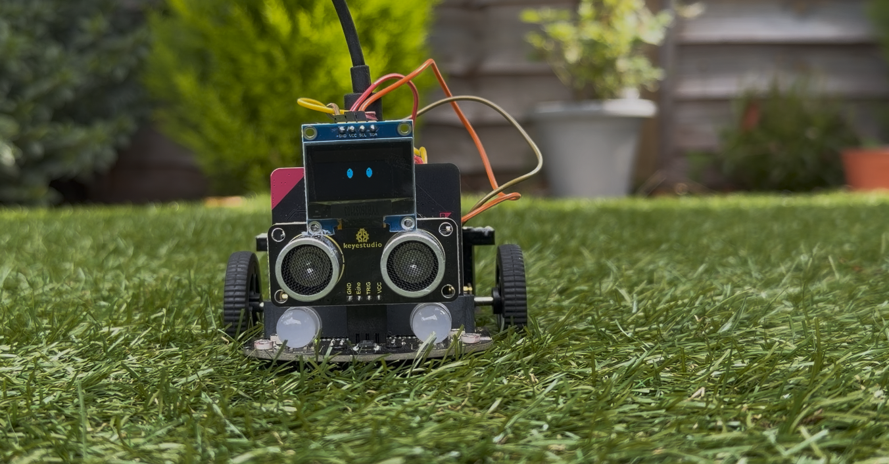
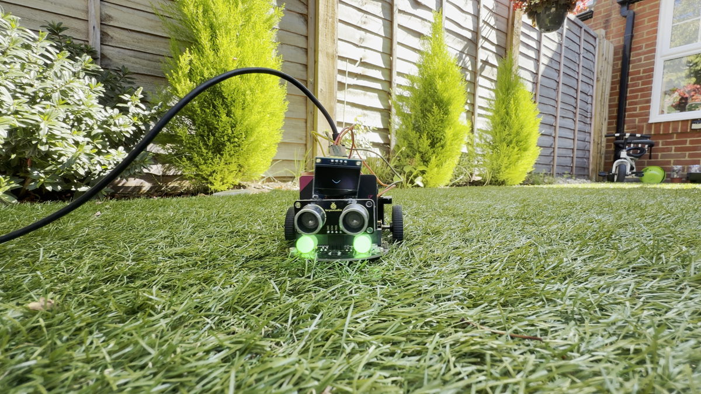
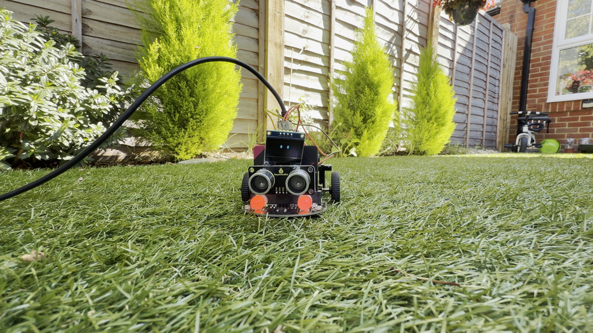
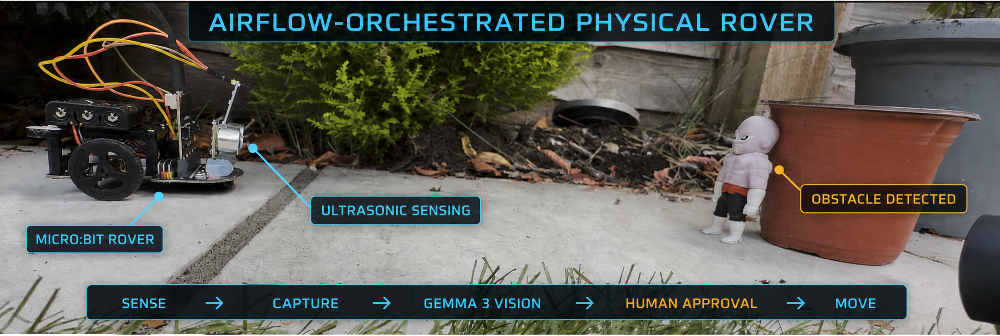
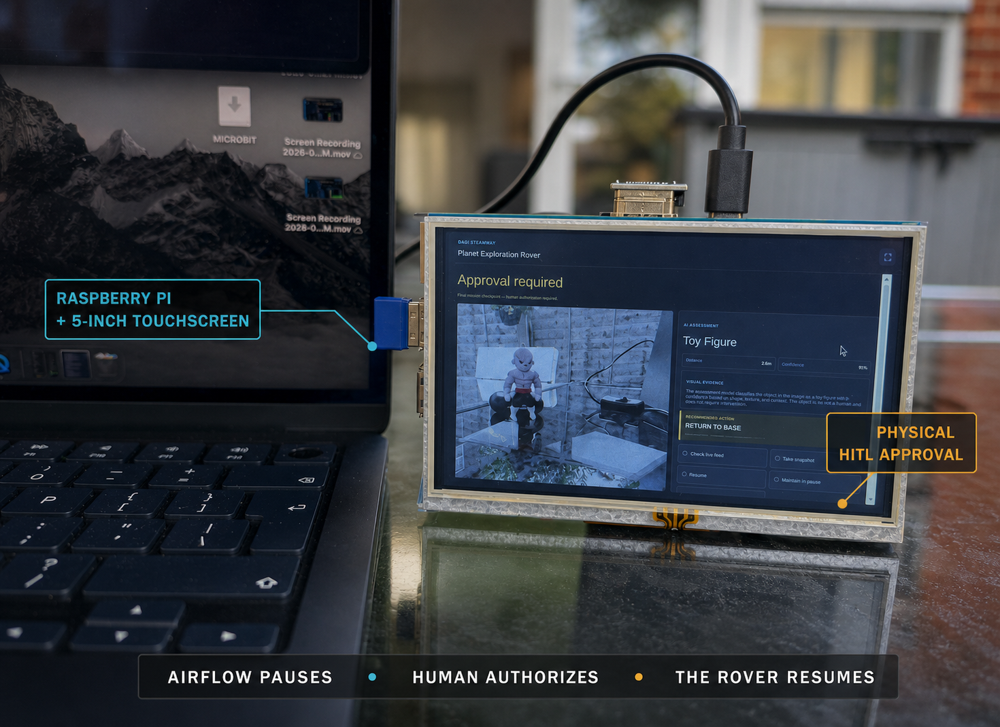
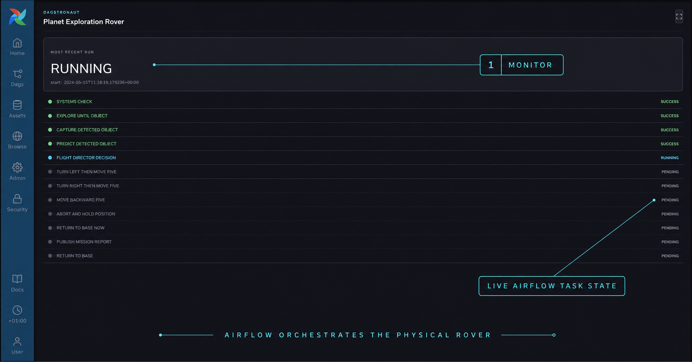
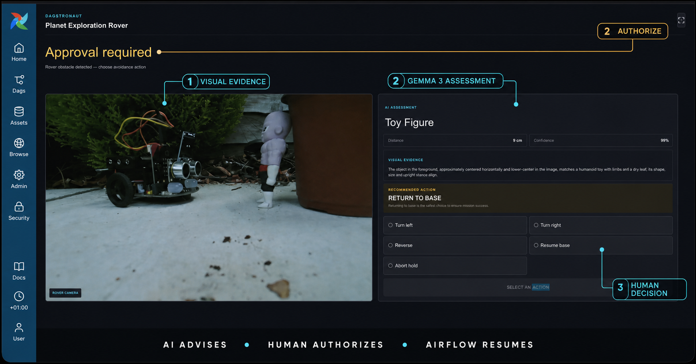

<div align="center">


<div> <big><big><big><strong>DAGstronaut</strong></big></big></big></div>

<h2>This DAG doesn't move data.<br />It moves a rover.</h2>


**An Apache Airflow 3.3 DAG that drives a physical micro:bit rover. It detects
obstacles with ultrasound, captures a photograph, and uses local Gemma 3 Vision
to classify what it sees, explain the visual evidence, and recommend a response.
Airflow then pauses at a human-in-the-loop decision, where a five-inch Flight
Director Console lets a person authorize the rover's next movement.**

[Beyond the DAG 2026](https://www.astronomer.io/events/beyond-the-dag-data-engineering-hackathon-2026/) · [Apache Airflow](https://airflow.apache.org/) · [Airflow Plugins](https://airflow.apache.org/docs/apache-airflow/stable/administration-and-deployment/plugins.html)

[](https://airflow.apache.org/)
[](https://www.python.org/)
[](https://react.dev/)
[](https://www.typescriptlang.org/)
[](https://fastapi.tiangolo.com/)
[](https://www.docker.com/)
[](https://ollama.com/)
[](https://microbit.org/)
[](LICENSE)


<br />


</div>

> [!NOTE]
> DAGstronaut is an independent open-source project created for
> Astronomer's **Beyond the DAG 2026** hackathon. “Astronomer” and related marks
> belong to their respective owners; this project is not an official
> Astronomer product.

## Submission at a glance

- **Category:** **Airflow Can Do That?!** — the wildcard track explicitly
  invites hardware projects that use Airflow as the engine. DAGstronaut also
  exercises the plugin, Common AI provider, and HITL capabilities highlighted
  by the other tracks, but is submitted in this single category.
- **Demo:** [watch the 51-second DAGstronaut demo](media/DAGstronaut-demo.mp4)
- **Airflow version:** Apache Airflow 3.3.0
- **License:** [Apache License 2.0](LICENSE)

## Why Space Theme?

Because the hackathon is run by [Astronomer](https://www.astronomer.io/), space felt like a natural theme. That inspired me to build DAGstronaut: a physical rover whose exploration, AI-assisted obstacle analysis, and human-authorized movements are orchestrated by Apache Airflow.

## What is DAGstronaut?



DAGstronaut is a physical rover workflow orchestrated end to end by Apache
Airflow 3.3. Instead of moving data between systems, its DAG moves a real machine
through the world—carefully, visibly, and with a human in command.

The rover advances one motor pulse at a time and checks its ultrasonic sensor
before every move. When it reaches an obstacle, it stops, captures a photograph,
and sends the image and distance telemetry to a local vision model. The model
explains what it sees and recommends a response, but it cannot move the rover.
An Airflow HITL task holds the mission until a human flight director reviews the
evidence and chooses what happens next.

Airflow is more than the scheduler behind the demo. The DAG defines the safety
sequence, XCom stores the rover's outbound path, task logs preserve the mission
record, and branch dependencies ensure that no physical action can bypass human
approval. After the chosen maneuver, the rover reverses its recorded steps and
returns to base.

A focused Airflow plugin turns a five-inch Raspberry Pi touchscreen into the
Flight Director Console. It shows the rover image, sensor readings, and AI
recommendation, then submits the human's selected branch through Airflow's HITL
REST API. It never talks to the rover directly.

> **The rover explores. AI advises. A human commands. Airflow brings it home.**

### Hardware components used

| Component | Purpose |
|---|---|
| [Keyestudio micro:bit robot car](https://www.keyestudio.com/collections/microbit-car-415) | Rover platform for physical missions. |
| [BBC micro:bit V2](https://microbit.org/new-microbit/) + [custom firmware](microbit_firmware/main.py) | Motor control, sensor reads, and rover behavior. |
| [Keyestudio CS100A ultrasonic module](https://www.keyestudio.com/products/keyestudio-quick-connectors-ultrasonic-modulecs100a-chip-black-environment-friendly) | Obstacle-distance telemetry before movement. |
| [128×64 I2C OLED display](https://www.amazon.co.uk/dp/B0FKLXL3DY) | Rover face with blinking eyes and behavior-specific expressions. |
| USB camera + OpenCV | Captures obstacle evidence for vision analysis. |
| Mac USB bridge | Connects containerized Airflow to the micro:bit hardware. |
| Raspberry Pi five-inch touchscreen | Physical Flight Director Console for HITL approval. |

### 1. DAG Reactions — workflow status becomes physical emotion

The first demo makes Airflow task outcomes visible in the physical world. Two
small, intentionally static DAGs each contain one task: a successful task calls
the rover bridge's `/happy` endpoint through an `on_success_callback`, while an
intentional failure calls `/sad` through an `on_failure_callback`. The same
callback pattern can drive a desk companion, status light, wearable, or other
physical interface.

The emote DAGs are deliberately not dynamic. Their value is the clear,
repeatable contract between workflow state and physical response:

<table>
<tr>
<td><br /><strong>Success → happy emote</strong></td>
<td><br /><strong>Failure → sad emote</strong></td>
</tr>
</table>

- `dagstronaut_emote_success.py` runs `complete_demo_task` and celebrates only
  after the task succeeds.
- `dagstronaut_emote_failure.py` runs `fail_demo_task` with retries disabled and
  signals distress when the task fails.
- The callback talks to the bridge; it does not bypass Airflow's task state or
  make the device a second orchestration system.

This is the companion pattern: **companions help us feel DAGs**. A success,
failure, or long-running state can become light, sound, movement, or haptics so
operators do not have to stare at a dashboard.

### 2. Planet Exploration Rover — a hardware-orchestrating Airflow DAG



The heart of the project is the `planet_exploration_rover` DAG, which controls a
real wheeled rover and coordinates a complete physical exploration mission.

The rover performs a motor systems check, moves forward one step at a time, and
sends an ultrasonic distance reading back to Airflow before every movement. At
the configured five-centimetre safety boundary, it stops and captures the
obstacle with a computer USB camera. Gemma Vision analyses the photograph and
sensor telemetry, then an Airflow HITL task asks a human flight director to
approve the next action. Airflow records outbound movement in XCom so the rover
can reverse the same number of steps and return to base.

**Airflow features used:**

- **`@task.llm` from `apache-airflow-providers-common-ai`** runs the multimodal
  assessment. The task sends the camera frame and sensor telemetry to a local
  Gemma 3 vision model and returns a Pydantic-validated `ObjectPrediction`
  through `NativeOutput`, so malformed model output fails the task instead of
  reaching the human. Only the compact assessment enters XCom—the JPEG and its
  base64 payload never touch the metadata database.
- **`HITLBranchOperator`** pauses the mission at the Flight Director's Console
  and routes execution to turn left, turn right, reverse, return to base, or
  abort. The model recommends; it cannot select the branch.
- **Jinja-templated HITL content** renders the object prediction, confidence,
  visual evidence, recommendation, and camera filename into the decision screen
  the human actually reads.
- **A named `outbound_steps` XCom**, rewritten after every successful forward
  movement, is the rover's durable mission memory. Return tasks read it to issue
  the matching number of backward motor pulses, so a mid-mission sensor failure
  still leaves a correct return distance recorded.
- **Branch-aware trigger rules** converge the mutually exclusive movement
  branches into one shared return-to-base task with
  `none_failed_min_one_success`, which then computes the inverse of whichever
  maneuver the human chose.
- **XComArg wiring** passes data by reference between a classic operator and a
  decorated task—`op_kwargs={"detection": explore.output}` feeding
  `predict_detected_object(capture.output)`—without a manual `xcom_pull`.
- **Task dependencies as safety interlocks.** The rover cannot explore before
  its systems check, photograph before detecting an obstacle, or move again
  before the human decision resolves. The graph is the safety model.
- **`max_active_runs=1`** prevents two missions from driving the same physical
  hardware at once.
- **`doc_md`** publishes the mission sequence, safety model, runtime
  architecture, and configuration table directly into the Airflow UI, so the
  DAG documents itself where an operator is standing.
- **Task logs and run history** preserve every sensor reading, bridge response,
  model assessment, human decision, and movement count—a replayable audit trail
  for an irreversible physical action.
- **A read-only Docker volume** exposes the captured photograph inside Airflow
  at `/opt/airflow/rover_captures`, keeping the camera on the Mac while the DAG
  task reads the evidence.

The custom micro:bit firmware is the rover's hardware-facing control layer. It
accepts newline-delimited commands at `115200` baud, validates each request,
drives the motors using short, bounded pulses, reads the ultrasonic sensor, and
updates the micro:bit LED matrix and OLED face. Every command finishes with an
`OK` or `ERR` response, giving an Airflow task a definite result instead of
merely assuming that a physical action happened. The implementation and
flashing instructions are documented in the
[micro:bit firmware guide](microbit_firmware/README.md).

The code in [`mac_os_api`](mac_os_api/) connects that firmware to Airflow.
[`usb_controller.py`](mac_os_api/usb_controller.py) discovers the micro:bit and
translates host commands into the USB serial protocol, while
[`usb_bridge.py`](mac_os_api/usb_bridge.py) wraps movement, distance sensing,
and camera capture in a lock-protected FastAPI service. Airflow reaches this
service from Docker through `host.docker.internal`, but only the firmware talks
directly to the rover hardware. See the
[USB controller and bridge guide](mac_os_api/USB_CONTROLLER_README.md) for the
complete command reference and setup.

Gemma 3 Vision runs locally through Ollama on the same host, so the captured
camera frame and inference remain local to the rover setup.

### 3. Flight Director Console — a physical approval surface







The second part is a dedicated approval screen mounted beside the rover and a
reference implementation for human-supervised IoT operations. An
[Apache Airflow 3](https://airflow.apache.org/docs/apache-airflow/stable/index.html)
plugin installs a React app designed for a five-inch Raspberry Pi touchscreen.
For this project it deliberately monitors only `planet_exploration_rover`,
showing its current run and task states. When `flight_director_decision` is
waiting, the display becomes an approval surface and presents:

- the camera evidence captured at the obstacle;
- ultrasonic distance from the rover;
- the validated AI classification, confidence, visual evidence, and
  recommendation;
- the movement branches that the DAG permits the human to authorize.

The selected command resolves the existing `HITLBranchOperator`. It does not
call the USB rover bridge or issue motor commands itself. The rover therefore
remains stopped until Airflow accepts the human response and resumes the DAG.

That separation is the useful pattern demonstrated by DAGstronaut. The edge
bridge owns immediate hardware communication and local safety; Airflow owns the
durable sequence, AI analysis, human decision, and audit trail. The console is
only a contextual client for a pending Airflow decision—not a second route to
the device.

Although the rover makes the pattern visible, the same architecture can
supervise other non-real-time IoT workflows: an agricultural system reviewing a
crop image before treatment, a warehouse robot requesting a route decision, a
laboratory instrument waiting before its next operation, or facilities equipment
requiring approval before a physical change. In each case, device-specific
real-time control stays at the edge while Airflow coordinates evidence,
recommendation, authorization, and traceability.

**Airflow features used:**

- **`AirflowPlugin`** registers the React app, evidence endpoint, and static
  bundle through Airflow's plugin manager.
- **`react_apps`** mounts the console as a native Airflow page at
  `/plugin/flight-director-console`.
- **The stable Airflow HITL REST API** discovers the pending request and submits
  `chosen_options` to `PATCH .../hitlDetails`; the console does not mutate the
  metadata database itself.
- **Airflow authentication and HITL permissions** apply to both reading and
  resolving the request because the browser uses its authenticated Airflow
  session.
- **`fastapi_apps`** exposes only the built UI assets, health status, and the
  captured rover JPEG needed as decision evidence.
- **Polling with stale-request protection** lets the display interrupt from
  standby while Airflow rejects an already-resolved response.
- **Fullscreen and responsive layouts** make the same native plugin usable on
  the Raspberry Pi touchscreen and a normal browser during development.

## What was hard

- **Writing the micro:bit firmware.** I did not have much prior experience with
  embedded development or MicroPython, so building the firmware was one of the
  steepest learning curves. I had to learn how to drive the motors over I2C,
  read the ultrasonic sensor, animate the OLED eyes, parse serial commands, and
  guarantee that the rover stopped safely after every action.
- **Bridging containers to physical hardware.** Airflow runs in Docker, while
  the micro:bit and camera belong to the macOS host. Designing the FastAPI
  bridge and serial protocol required a reliable boundary between those two
  environments, including locking so concurrent tasks cannot send conflicting
  rover commands.
- **Recording a physical and digital workflow together.** The rover, browser,
  and Raspberry Pi display were recorded separately, which made it challenging
  to tell one coherent story. I used Codex and FFmpeg to inspect the clips,
  synchronize the rover movement with the live Airflow task state, create the
  transitions, and assemble the final demo video.

## Run it locally

### Prerequisites

- Docker with Docker Compose
- Python 3.10 or later
- Node.js 22 or later and `pnpm`
- [Ollama](https://ollama.com/) with the `gemma3:4b` model
- A Keyestudio KS4036 rover with a micro:bit V2, ultrasonic sensor, and USB data
  cable
- A USB camera; the Raspberry Pi touchscreen is optional for running the DAG

### 1. Install the host bridge and local model

From the repository root:

```bash
python3 -m venv .venv
source .venv/bin/activate
python3 -m pip install -r requirements.txt
ollama pull gemma3:4b
```

Flash [`microbit_firmware/main.py`](microbit_firmware/main.py) to the micro:bit
using the [micro:bit Python Editor](https://python.microbit.org/). The
[firmware guide](microbit_firmware/README.md) documents the serial protocol,
wiring, movement model, and safety behavior.

### 2. Build the Flight Director Console

```bash
cd airflow_docker/widgets/flight-director-console
pnpm install
pnpm typecheck
pnpm build
cd ../../..
```

### 3. Start the USB and camera bridge

Connect and power the rover, then run this in its own terminal:

```bash
source .venv/bin/activate
python3 mac_os_api/usb_bridge.py
```

Verify the bridge before starting a mission:

```bash
curl http://127.0.0.1:8765/health
curl http://127.0.0.1:8765/distance
curl http://127.0.0.1:8765/camera/status
```

If the wrong camera is selected, set `USB_CAMERA_INDEX` as described in the
[USB controller and bridge guide](mac_os_api/USB_CONTROLLER_README.md).

### 4. Start Airflow 3.3

```bash
cd airflow_docker
docker compose up --build -d
```

Open <http://localhost:8080>, sign in with `airflow` / `airflow`, enable
`planet_exploration_rover`, and trigger a run. Open the companion app at
<http://localhost:8080/plugin/flight-director-console>. Airflow pauses at
`flight_director_decision` until an authenticated user selects one of the
permitted actions.

To stop the local deployment without deleting its database volume:

```bash
docker compose down
```

The default Compose configuration reaches the host bridge and Ollama through
`host.docker.internal`. See `ROBOT_BRIDGE_URL`, `OLLAMA_BASE_URL`,
`ROVER_VISION_MODEL`, and `ROVER_CAPTURE_DIR` in
[`docker-compose.yaml`](airflow_docker/docker-compose.yaml) when adapting the
setup to another host.

## Beyond the data pipeline

For me, DAGstronaut is an exploration of a broader idea: Airflow can orchestrate
more than data pipelines. If a process can be expressed as observable steps,
dependencies, retries, decisions, and outcomes, it can potentially be modelled
as a workflow—even when some of those steps happen in the physical world.

That could mean coordinating sensor readings across an IoT deployment,
reviewing crop and soil telemetry before an agricultural treatment, scheduling
inspection and maintenance for remote equipment, asking a warehouse operator
to approve a robot's next task, or pausing a laboratory process until its
measurements have been reviewed. Airflow can provide the durable history,
failure handling, AI-assisted analysis, human approval, and audit trail around
those operations.

Airflow should not replace the real-time controller or safety logic on a
device. Those responsibilities remain at the edge, close to the hardware. The
opportunity is to use Airflow as the orchestration layer above it: connecting
sensors, software, AI, and people into one understandable and accountable
workflow.

## About me

I'm [Rahul Rajasekharan](https://www.rahulrajasekharan.dev/), a Senior Data
Engineer based in London. I work across the modern data stack, including Apache
Airflow, dbt, PySpark, AWS, Python, and generative AI. I enjoy automating
repetitive work, improving the developer experience, and exploring unusual but
useful ways to turn software, data, AI, and—as DAGstronaut demonstrates—physical
hardware into clean, observable systems.

You can find more of my work and experience on
[rahulrajasekharan.dev](https://www.rahulrajasekharan.dev/) or connect with me
on [LinkedIn](https://www.linkedin.com/in/rahul-rajasekharan-012506121/).

## License

DAGstronaut is available under the [Apache License 2.0](LICENSE).

---
