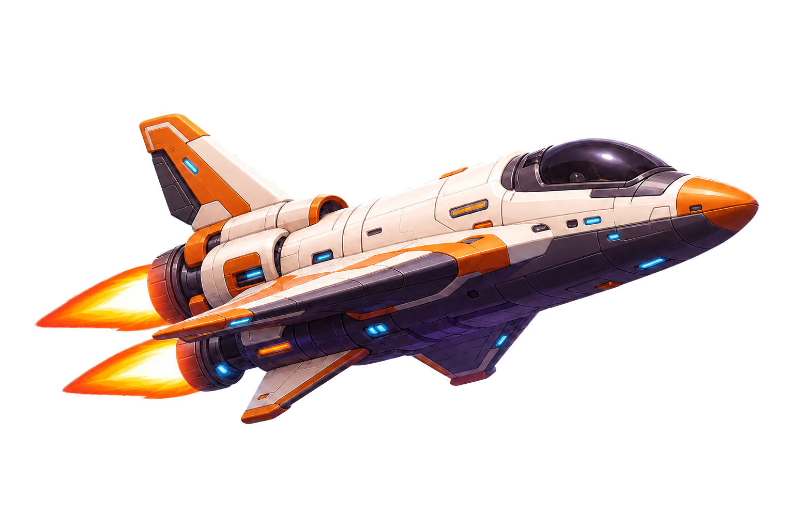

<div align="center">



# Astro Mission Control

### Airflow can orchestrate more than data pipelines—it can orchestrate hardware too.

**An Astronomer-inspired space operations platform that monitors DAGs as rockets and uses Airflow to command a physical planetary rover—from launch and orbital transit to sensing, human decisions, recovery, or impact.**

<br />

[](https://airflow.apache.org/)
[](https://www.python.org/)
[](https://react.dev/)
[](https://www.typescriptlang.org/)
[](https://fastapi.tiangolo.com/)
[](https://www.docker.com/)
[](https://ollama.com/)
[](https://microbit.org/)
[](LICENSE)

[Beyond the DAG 2026](https://www.astronomer.io/events/beyond-the-dag-data-engineering-hackathon-2026/) · [Apache Airflow](https://airflow.apache.org/) · [Airflow Plugins](https://airflow.apache.org/docs/apache-airflow/stable/administration-and-deployment/plugins.html)

</div>

---

> [!NOTE]
> Astro Mission Control is an independent open-source project created for
> Astronomer's **Beyond the DAG 2026** hackathon. “Astronomer” and related marks
> belong to their respective owners; this project is not an official
> Astronomer product.

## Why space and rockets?

Because this hackathon is organized by
[Astronomer](https://www.astronomer.io/), I wanted the project to carry an
unmistakable Astronomer flavour. Space, rockets, missions, flight directors,
and orbital telemetry provide a natural visual language for showing what
Airflow does: workflows launch, move through coordinated stages, report live
state, request human guidance, and eventually land successfully or require
recovery. The theme is more than decoration—it makes orchestration status
immediately visible while celebrating the community behind the
[Beyond the DAG 2026](https://www.astronomer.io/events/beyond-the-dag-data-engineering-hackathon-2026/)
hackathon.

## What is this project?

Astro Mission Control is an open-source demonstration of Airflow as both a
workflow observability platform and a physical mission orchestrator. The
project has two connected parts.

### 1. Space Mission Control — an Airflow UI plugin

The first part is an [Apache Airflow 3](https://airflow.apache.org/docs/apache-airflow/stable/index.html)
plugin that reimagines DAG monitoring as a space operations center. Each DAG is
represented as a rocket, and its real Airflow state becomes a stage of the
mission:

- Scheduled and queued DAGs prepare for launch.
- Running DAGs enter orbital transit with live mission telemetry.
- Successful DAGs land safely and join the recovery fleet.
- Failed DAGs appear in the Impact Zone for investigation and crash replay.
- Paused DAGs enter Cryogenic Hold.
- Pending HITL tasks wait at the Flight Director's Console for human input.

The plugin combines an Airflow `react_app` with a FastAPI telemetry service to
provide a command overview, animated state views, task constellations, failure
replay, resource telemetry, a Rocket Test Bench, and a rotating five-inch
mission display. It preserves native links to DAGs, runs, tasks, and logs while
giving everyday Airflow operations an Astronomer-flavoured mission language.

**Airflow concepts used technically:**

- **`AirflowPlugin`** registers the complete extension with Airflow's plugin
  manager.
- **`react_apps`** mounts the React and TypeScript Mission Control interface as
  a native top-level page in the Airflow UI.
- **`fastapi_apps`** mounts a plugin-owned FastAPI application under
  `/mission-control-api` for mission telemetry, DAG details, host resources,
  static assets, and Rocket Test Bench requests.
- **Airflow metadata models**—`DagModel`, `DagRun`, and `TaskInstance`—provide
  real DAG configuration, latest-run state, timing, and task-instance data.
- **Airflow HITL metadata** identifies unresolved human decisions and maps them
  to the Flight Director's Console.
- **DAG tags** select a stable rocket class such as `rocket:heavy`,
  `rocket:shuttle`, or `rocket:courier`, and power fleet filtering.
- **Task dependencies and task-instance state** create the task-constellation
  graph, progress display, mission timing, and animated failure replay.
- **Native Airflow deep links** take operators from a rocket directly to its
  DAG, current run, task instance, and logs.
- **The Airflow CLI** powers Rocket Test Bench with `airflow tasks test`,
  including logical dates and optional task parameters.
- **Live polling** keeps the plugin synchronized with changing Airflow state
  without introducing a separate monitoring database.

#### Rocket Test Bench

Space Mission Control also turns Airflow's task-test capability into a visual
rocket-testing station. An operator selects a DAG, task, and logical date in
the plugin, optionally supplies a JSON parameters object, and ignites an
isolated task test from the command deck.

The station executes the equivalent Airflow command:

```bash
airflow tasks test <DAG_ID> <TASK_ID> <LOGICAL_DATE> \
  --task-params '{"key":"value"}'
```

The plugin's FastAPI endpoint validates the request and runs the command in the
Airflow API-server environment. Bench runs are serialized to prevent unbounded
parallel subprocesses and are limited to five minutes. The station captures
the exact command, combined task logs, execution duration, exit code, and
truncation status, then presents the result as a clear **PASS** or **FAIL**
engine diagnostic. Because it uses `airflow tasks test`, the task can be tested
without creating a normal scheduled task instance or DagRun.

A secondary Raspberry Pi with a five-inch display acts as the controller's
dedicated cockpit screen. It opens the plugin's small-screen view in fullscreen
mode and rotates every ten seconds through high-level running, successful,
failed, queued, scheduled, paused, and HITL mission status. This gives the
operator an always-on, glanceable view of the Airflow fleet while the main
Mission Control interface remains available for detailed investigation. The
Raspberry Pi is used only as a cockpit display; rover commands, USB sensor data,
and camera capture continue to pass through the Mac-hosted bridge.

### 2. Planet Exploration Rover — a hardware-orchestrating Airflow DAG

The second part demonstrates that Airflow can orchestrate more than data. The
`planet_exploration_rover` DAG controls a real wheeled rover and coordinates a
complete physical exploration mission.

The rover performs a motor systems check, moves forward one step at a time, and
sends an ultrasonic distance reading back to Airflow before every movement. At
the configured five-centimetre safety boundary, it stops and captures the
obstacle with a computer USB camera. Gemma Vision analyses the photograph and
sensor telemetry, then an Airflow HITL task asks a human flight director to
approve the next action. Airflow records outbound movement in XCom so the rover
can reverse the same number of steps and return to base.

**Airflow concepts used technically:**

- **An Airflow DAG as the mission state machine** defines the ordered physical
  workflow: systems check → exploration → camera and vision analysis → human
  decision → selected maneuver → return to base → mission report.
- **`PythonOperator` tasks** call the Mac-hosted bridge for rover movement,
  ultrasonic readings, camera capture, Gemma analysis, route recovery, and
  report generation. Each physical operation remains visible and auditable as
  an Airflow task instance.
- **A computer USB camera and OpenCV** capture a forward-facing JPEG only after
  the ultrasonic sensor reaches the five-centimetre safety boundary. The
  Mac-hosted FastAPI bridge writes the image to `rover_captures/`.
- **A read-only Docker volume** exposes that same photograph inside Airflow at
  `/opt/airflow/rover_captures`, keeping the camera attached to the Mac while
  allowing the DAG task to access the captured evidence.
- **Gemma 3 Vision through local Ollama** receives the JPEG together with the
  ultrasonic distance and outbound-step telemetry. It predicts the broad
  obstacle type, confidence, supporting evidence, and a recommended safe
  action.
- **A Pydantic response schema** validates Gemma's output before it can reach
  the human decision task. Only the compact structured assessment and image
  metadata enter XCom; the large image and base64 payload remain outside the
  Airflow metadata database.
- **Task dependencies** enforce safety boundaries. The rover cannot explore
  before its systems check, take a photograph before detecting an obstacle, or
  move again before the human decision task completes.
- **XCom return values** carry structured detection samples, image-analysis
  results, selected-action metadata, and the final mission report between
  tasks.
- **A named `outbound_steps` XCom** is updated after every successful forward
  movement. Return tasks use this durable mission memory to issue the matching
  number of backward motor pulses.
- **`HITLBranchOperator`** pauses the mission at the Flight Director's Console
  and routes execution to turn left, turn right, reverse, return to base, or
  abort safely.
- **Jinja-templated HITL content** presents the Gemma object prediction,
  confidence, visual evidence, recommendation, and camera filename to the
  human decision-maker inside Airflow.
- **Branch-aware trigger rules** converge the mutually exclusive movement
  branches into one shared return-to-base task with
  `none_failed_min_one_success`.
- **Airflow task logs and run history** preserve sensor readings, bridge
  responses, AI output, human decisions, movement counts, and the final mission
  outcome for replay and investigation.
- **`max_active_runs=1`** prevents two rover missions from controlling the same
  physical hardware concurrently.

The physical build uses:

- A [BBC micro:bit board](https://www.keyestudio.com/collections/microbit-board)
  running the rover's MicroPython firmware
- A [Keyestudio micro:bit robot car](https://www.keyestudio.com/collections/microbit-car-415)
  as the mobile rover platform
- A [Keyestudio CS100A ultrasonic module](https://www.keyestudio.com/products/keyestudio-quick-connectors-ultrasonic-modulecs100a-chip-black-environment-friendly)
  for obstacle-distance telemetry
- A computer USB camera for obstacle photographs and Gemma Vision analysis
- A USB connection to the Mac bridge that exposes rover movement, sensor, and
  camera operations to Airflow

---

_This is the first README section. Architecture, features, the physical rover
mission, installation, screenshots, and contributor documentation will be
added after the project narrative is refined._
